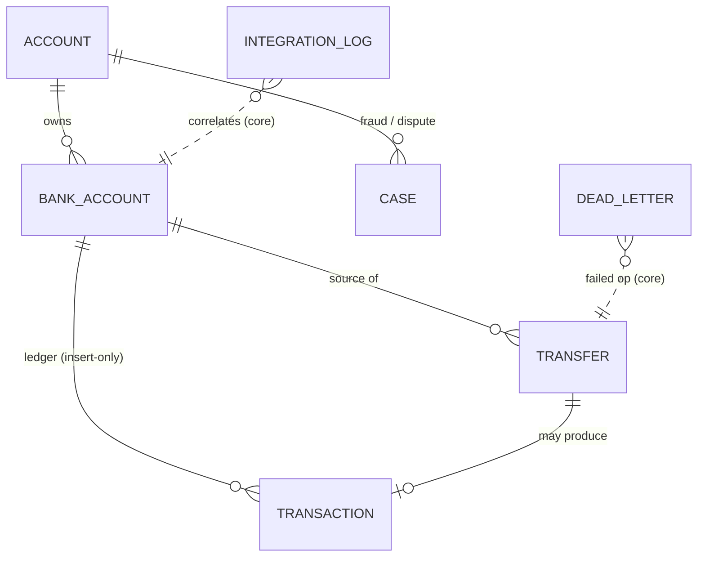
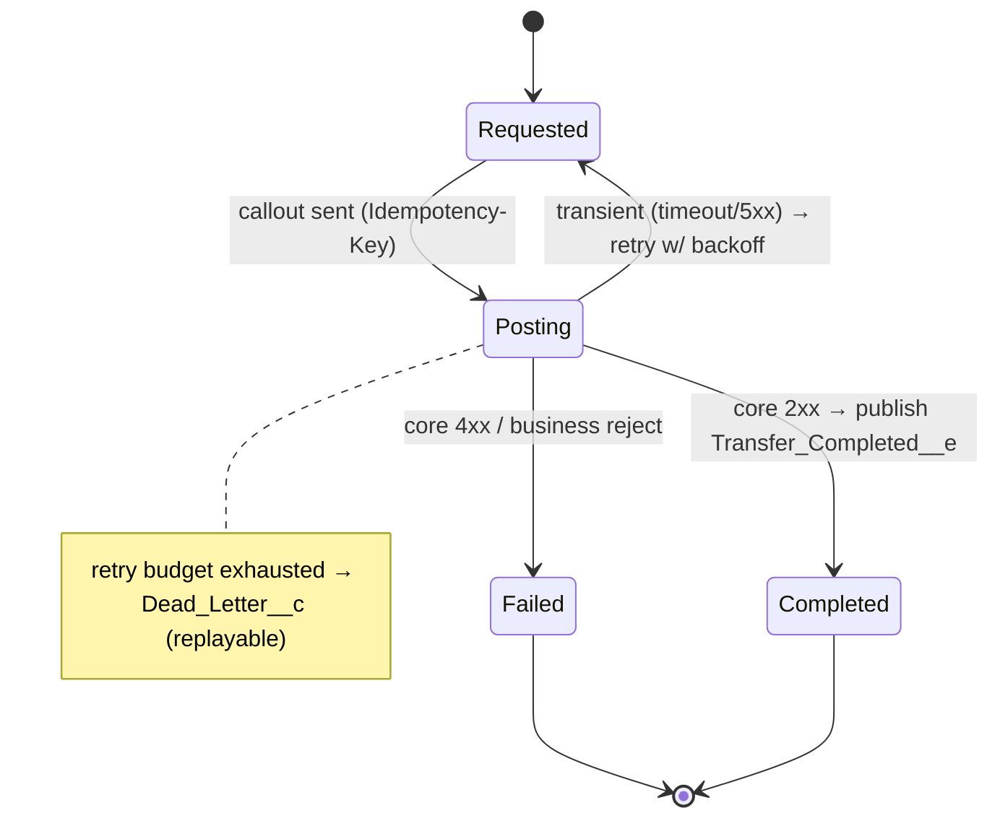

# Data Model — Banking App (project #2)

> **Exercises:** data modeling, large-data-volume (LDV) & selectivity, schema for
> integration. **JD lines:** "Data Modeling & Salesforce Architecture… large data
> volumes, indexing and query performance… scalable patterns"; "Salesforce Integration
> patterns." **RTM design coverage:** FR-1..6, NFR-2, NFR-4, NFR-7.

## Principle: Salesforce is the servicing layer, core banking is the source of truth

Money lives in the **external core-banking system**. Salesforce **caches** balances for
fast reads and holds the servicing/CRM records and an **immutable ledger** mirror. The
daily reconciliation job (NFR-7) keeps the cache honest.

## ERD

`INTEGRATION_LOG` and `DEAD_LETTER` are **platform-core** objects (package
`frs-platform-core`); the rest belong to `frs-banking`.

## Objects & key fields

### Account (standard) — the customer
Reused standard object (Person/Business). No custom money fields here.

### `Bank_Account__c` (frs-banking) — OWD **Private**
| Field | Type | Notes |
|---|---|---|
| `Customer__c` | Lookup(Account) | owner/customer |
| `Core_Account_Id__c` | Text(External ID, Unique) | key into core banking |
| `Account_Number__c` | Text | **masked** at display; confidential (see data-classification) |
| `Type__c` | Picklist | Checking / Savings |
| `Balance_Minor__c` | Number(18,0) | **cached** balance in **minor units (cents)** — never float; source of truth = core banking |
| `Balance_As_Of__c` | DateTime | freshness of the cached balance |
| `Status__c` | Picklist | Active / Frozen / Closed |

### `Transaction__c` (frs-banking) — the immutable ledger (**LDV**)
Insert-only. Highest-volume object; designed for selectivity.
| Field | Type | Notes |
|---|---|---|
| `Bank_Account__c` | Master-Detail/Lookup | indexed FK |
| `External_Txn_Id__c` | Text(External ID, **Unique**) | inbound **idempotency** (dedupe replayed webhooks) |
| `Amount_Minor__c` | Number(18,0) | minor units |
| `Direction__c` | Picklist | Debit / Credit |
| `Posted_At__c` | DateTime | indexed; history sort key |
| `Type__c` | Picklist | transfer / fee / interest / adjustment |

**LDV / selectivity notes:** queries are always account-scoped + time-bounded
(`Bank_Account__c = :id AND Posted_At__c >= :since ORDER BY Posted_At__c DESC LIMIT n`).
`External_Txn_Id__c` unique index serves inbound dedupe. At true volume consider a custom
index / skinny table and **keyset pagination** (the lesson proven in the sibling
banking-system: per-account + time-ordered is the access pattern to index for).

### `Transfer__c` (frs-banking) — a money movement (state machine)
| Field | Type | Notes |
|---|---|---|
| `From_Bank_Account__c` | Lookup | must belong to caller (authZ) |
| `To_Account_Number__c` | Text | destination (may be external) |
| `Amount_Minor__c` | Number(18,0) | minor units, > 0 |
| `Idempotency_Key__c` | Text(**Unique**) | outbound dedupe (no double-post) |
| `Status__c` | Picklist | Requested / Posting / Completed / Failed |
| `Core_Transfer_Id__c` | Text | id returned by core banking |
| `Failure_Reason__c` | Text | populated on Failed |

### `Integration_Log__c` (frs-platform-core)
`Correlation_Id__c`, `Category__c`, `Direction__c` (Outbound/Inbound), `Status__c`,
`Endpoint_Alias__c` (Named Credential name, **never** a URL/secret),
`Payload_Redacted__c`, `Retry_Count__c`. Structured, payload-safe logging for every callout.

### `Dead_Letter__c` (frs-platform-core)
`Operation_Type__c`, `Payload__c` (redacted/safe), `Attempts__c`, `Status__c`
(Pending/Replayed/Abandoned), `Correlation_Id__c`, `Last_Error__c`. Entry point for replay
after retry exhaustion (NFR-3).

## Money representation

Stored as **integer minor units** (`Number(18,0)`), never floating point — exact by
construction (carries the banking-system lesson into the SF model). Display formats to
currency at the edge. (Salesforce `Currency` type is the idiomatic alternative; minor-unit
integers chosen to make the no-rounding-error discipline explicit — recorded as a decision.)
