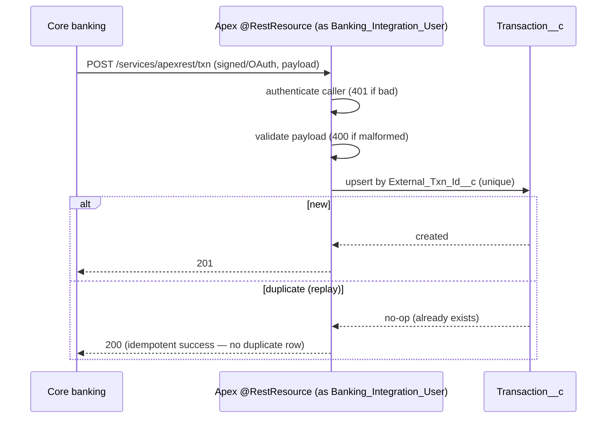
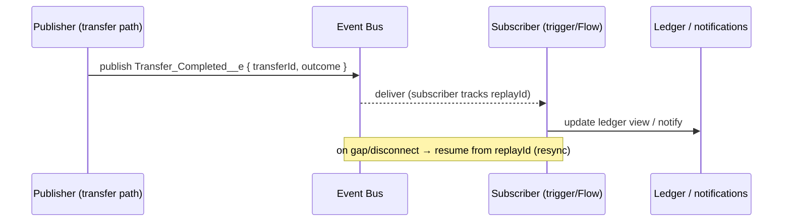

# Sequence Diagrams — Banking App (project #2)

> **Exercises:** integration patterns made concrete; design-before-code. **JD line:**
> "Salesforce Integration patterns." **RTM design coverage:** FR-1, FR-2, FR-3, FR-5,
> NFR-2, NFR-3, NFR-6. The four core flows the project is built around.

## §1 — Balance lookup (FR-1): Request–Reply, fail-soft

```mermaid
sequenceDiagram
  participant U as Agent (LWC)
  participant C as Apex controller (with sharing)
  participant CS as CalloutService (frs-platform-core)
  participant NC as Named Credential
  participant CB as Core banking (Vercel mock)

  U->>C: getAccount(accountId)
  C->>C: enforce sharing/FLS (USER_MODE)
  C->>CS: fetchBalance(coreAccountId)  [Idempotency not needed: read]
  alt circuit closed
    CS->>NC: GET balance (alias + path)
    NC->>CB: GET /accounts/:id/balance
    CB-->>NC: 200 { balance }
    NC-->>CS: 200
    CS->>CS: log (redacted) → Integration_Log__c
    CS-->>C: balance + asOf
    C-->>U: render balance
  else timeout / 5xx / breaker open
    CS->>CS: log failure; maybe trip breaker
    CS-->>C: unavailable
    C-->>U: "balance temporarily unavailable" (fail-soft, cached asOf)
  end
```

## §2 — Transfer (FR-2): async Request–Reply, idempotent, retry → dead-letter

```mermaid
sequenceDiagram
  participant U as Agent (LWC)
  participant C as Apex controller
  participant T as Transfer__c
  participant Q as Queueable (frs-platform-core)
  participant CS as CalloutService
  participant CB as Core banking
  participant EB as EventBus (Platform Event)

  U->>C: submitTransfer(from, to, amount, idemKey)
  C->>C: authZ (from belongs to caller) + validate
  C->>T: insert Status=Requested (Idempotency_Key unique)
  C-->>U: 202 accepted (Transfer id)
  C->>Q: enqueue(transferId)
  Q->>CS: POST transfer (Idempotency-Key)
  CS->>CB: POST /transfers
  alt 2xx
    CB-->>CS: 200 { coreTransferId }
    CS-->>Q: success
    Q->>T: Status=Completed, Core_Transfer_Id set
    Q->>EB: publish Transfer_Completed__e
  else transient (timeout/5xx) within budget
    CB-->>CS: 5xx/timeout
    Q->>Q: re-enqueue with backoff (retry++)
  else retries exhausted
    Q->>T: Status=Failed
    Q->>CS: write Dead_Letter__c (replayable)
  else duplicate idemKey (conflict)
    CB-->>CS: 409
    Q->>T: Status=Completed (replay of original; no double-post)
  end
```

## §3 — Inbound posted-transaction webhook (FR-3): Remote Call-In, replay-safe



## §4 — Platform Event on completion (FR-5): Fire-and-Forget


